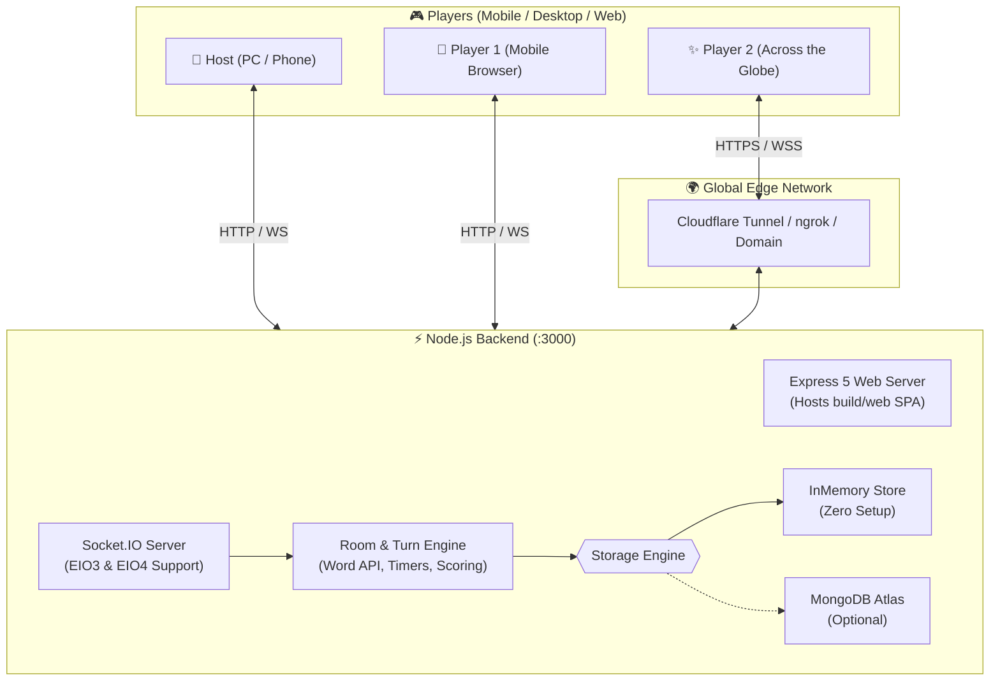

# 🎀 Skribbl.io - Cute Pink Pixel Art Edition 🎨💖  

<div align="center">


**A real-time multiplayer drawing and guessing game built with Flutter and Node.js, styled in an adorable retro Japanese kawaii pixel-art theme.**

[Features](#-key-features) • [Quick Start](#-quick-start) • [Global Multiplayer](#-playing-across-the-globe) • [Architecture](#-architecture) • [Theme Guide](#-cute-pixel-art-theme)

</div>

---

## 🌸 Overview

**Skribbl.io Pixel Edition** reimagines the classic online multiplayer party game with a charming retro pixel-art aesthetic. One player draws a secret word on an interactive canvas, while other players guess in real time through live chat. 

Whether playing together on the same Wi-Fi router or across different continents, friends can join instantaneously with simple **6-character alphanumeric room codes** or one-click **invite links**.

---

## ✨ Key Features

- **💖 Cute Pink Pixel Art Aesthetic**: Custom retro UI featuring Google Fonts (`Silkscreen` and `VT323`), 3D beveled button offsets, chunky borders, and Tamagotchi lounge graphics.
- **🌙 Reactive Dark & Light Mode**: Instant one-tap toggle between **Strawberry Milk** (Light Mode) and **Cyberpunk Midnight Plum** (Dark Mode) across all game screens without losing state.
- **🏷️ Auto-Generated Alphanumeric Room Codes**: 6-character clean room codes (e.g. `K9X2B7`, `7P4M8K`) with:
  - 🎲 **Re-Roll Button**: Generate new randomized codes on demand.
  - 📋 **One-Tap Copy & Paste**: Native clipboard integration for seamless sharing.
- **🌍 Global Multiplayer & 1-Click Invite Links**:
  - Automatically formats shareable links: `https://<domain>/?room=K9X2B7`.
  - Friends opening the invite link have their room code automatically pre-filled!
  - Fully compatible with Cloudflare Tunnels, ngrok, or cloud deployments.
- **🖌️ Real-Time Drawing Canvas**:
  - Sub-second touch point synchronization over WebSockets.
  - Pixel palette with quick color swatches and a full custom block color picker.
  - Adjustable stroke widths and clear-canvas tools.
- **💬 Live Chat & Intelligent Scoring**:
  - Guessing chat with secret-word detection and speed-based bonus point calculations.
  - Word blank dashes showing character counts (`_ _ _ _ _`).
  - Animated live scoreboard and winner leaderboard.
- **⚡ Zero-Config Dual Backend**:
  - **In-Memory Room Store**: Runs out of the box with zero external database dependencies.
  - **MongoDB Atlas Support**: Automatically hooks up to MongoDB if `MONGODB_URI` environment variable is provided.
- **📱 Built-in Web SPA Hosting**:
  - The Node.js Express server automatically hosts the compiled Flutter Web application (`build/web`).
  - Mobile phones visiting the server address load the full Flutter client directly in Safari or Chrome without installing an APK!

---

## 📸 Screenshots & UI Showcase

### 🏠 Home Screen (Tamagotchi Lounge)
| 🍓 Light Mode | 🌙 Dark Mode |
| :---: | :---: |
|  |  |

### 🎮 Room Creation & Joining
| 🎲 Create Room (Light) | 🌙 Create Room (Dark) | 🏷️ Join Room (Paste Support) |
| :---: | :---: | :---: |
|  |  |  |

---

## 🎨 Cute Pixel Art Theme

| Mode | Background | Windows / Cards | Borders & Shadows | Primary Accents |
| :--- | :--- | :--- | :--- | :--- |
| **Light Mode 🍓** | Strawberry Milk (`#FFF0F5`) | Clean Cream (`#FFFFFF`) | Dark Chocolate Plum (`#3B1A34`) | Vibrant Berry Pink (`#FF6B97`) |
| **Dark Mode 🌙** | Midnight Plum (`#180A18`) | Cyber Slate (`#261226`) | Glowing Neon Berry (`#FF8DAF`) | Neon Yellow & Lilac |

---

## 🏗️ Architecture



---

## 🚀 Quick Start

### 📋 Prerequisites
- [Flutter SDK](https://docs.flutter.dev/get-started/install) (v3.0.0 or higher)
- [Node.js](https://nodejs.org/) (v16.0.0 or higher)

---

### 1️⃣ Clone the Repository
```bash
git clone https://github.com/IshaNayal/Skribbl.io.git
cd Skribbl.io
```

### 2️⃣ Set Up Backend Server
```bash
cd server
npm install
node index.js
```
The server will start on port `3000`:
```text
Serving Flutter Web app from: .../build/web
MONGODB_URI is not set; running with in-memory room store.
Server started and running on port 3000
```

> **Optional MongoDB**: If you want persistent database storage, create a `server/.env` file with `MONGODB_URI=your_mongodb_connection_string`.

---

### 3️⃣ Run Flutter App
Open a new terminal window at the project root:

```bash
# Get Flutter packages
flutter pub get

# Run on Chrome Web
flutter run -d chrome

# OR run on Windows Desktop
flutter run -d windows

# OR run on Android device
flutter run -d android
```

---

## 🌍 Playing Across the Globe

To host a game and invite friends from anywhere in the world (different Wi-Fi networks, 4G/5G mobile data) without configuring port forwarding:

### Option A: Free Cloudflare Tunnel (Recommended)
In your terminal, run:
```bash
npx cloudflared tunnel --url http://localhost:3000
```
This generates a secure public HTTPS URL (e.g., `https://random-subdomain.trycloudflare.com`). 

1. Open the URL in your browser and click **Create**.
2. Click **Share Link** in the waiting lobby.
3. Send the link to friends anywhere in the world. When they click it, the room code is pre-filled and they can join with one tap!

### Option B: ngrok
```bash
ngrok http 3000
```

---

## 📂 Project Structure

```text
Skribbl_io/
├── lib/
│   ├── config.dart                    # Dynamic server URL resolution & invite link generator
│   ├── create_room_screen.dart        # Host room setup with auto-generated alphanumeric code
│   ├── final_leaderboard.dart         # Retro podium and winner display
│   ├── home_screen.dart               # Tamagotchi Lounge menu & room actions
│   ├── join_room_screen.dart          # Join lobby with clipboard paste button
│   ├── main.dart                      # App entry point with reactive ValueListenableBuilder
│   ├── models/
│   │   ├── my_custom_painter.dart     # Canvas painter for smooth touch lines
│   │   └── touch_points.dart          # Touch coordinate & stroke data model
│   ├── paint_screen.dart              # Main game screen (drawing canvas, chat, timer, tools)
│   ├── sidebar/
│   │   └── player_scoreboard__drawer.dart # In-game live scoreboard drawer
│   ├── theme/
│   │   └── pixel_theme.dart           # Pixel art palette, dynamic dark/light getters, fonts
│   ├── utils/
│   │   └── room_code_generator.dart   # 6-character alphanumeric code generator & parser
│   ├── waiting_lobby_screen.dart      # Roster lobby with copy code & invite link buttons
│   └── widgets/
│       ├── custom_text_field.dart     # Retro themed pixel input field
│       └── pixel_widgets.dart         # PixelButton, PixelWindow, PixelBadge, PixelThemeToggle
│
├── server/
│   ├── api/
│   │   └── getWord.js                 # Random secret word dictionary generator
│   ├── models/
│   │   ├── Player.js                  # Player schema
│   │   └── Room.js                    # Mongoose Room schema
│   ├── index.js                       # Express 5 + Socket.IO + In-Memory Room Store
│   └── package.json                   # Backend dependencies
│
└── test/
    ├── room_code_generator_test.dart  # Unit tests for code generation & URL parsing
    └── widget_test.dart               # Widget tests for room flows & buttons
```

---

## 🧪 Testing

Run Flutter analyzer and unit/widget test suites:

```bash
# Verify static code analysis (0 errors)
flutter analyze

# Run all widget & unit tests
flutter test -j 1
```

---

## 🤝 Contributing

Contributions, issues, and feature requests are welcome!
1. Fork the Project.
2. Create your Feature Branch (`git checkout -b feature/CuteFeature`).
3. Commit your Changes (`git commit -m 'Add some CuteFeature'`).
4. Push to the Branch (`git push origin feature/CuteFeature`).
5. Open a Pull Request.

---

## 📄 License

Distributed under the **MIT License**. See `LICENSE` for more information.

<div align="center">

Crafted with 💖 and 🍓 pixels by [Isha Nayal](https://github.com/IshaNayal)

</div>
