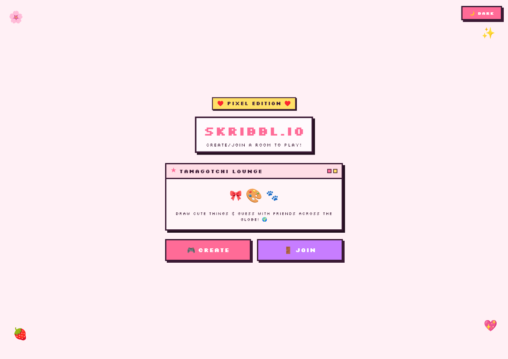
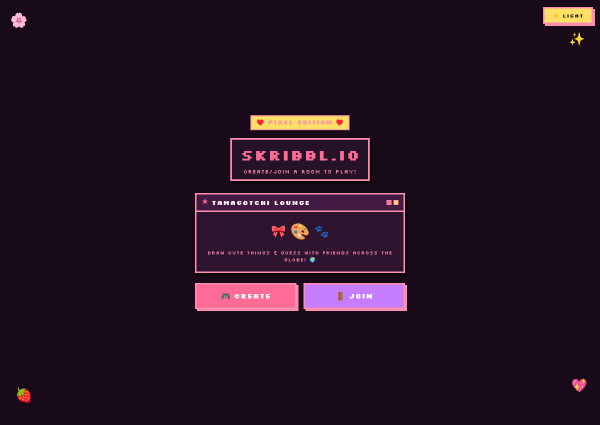
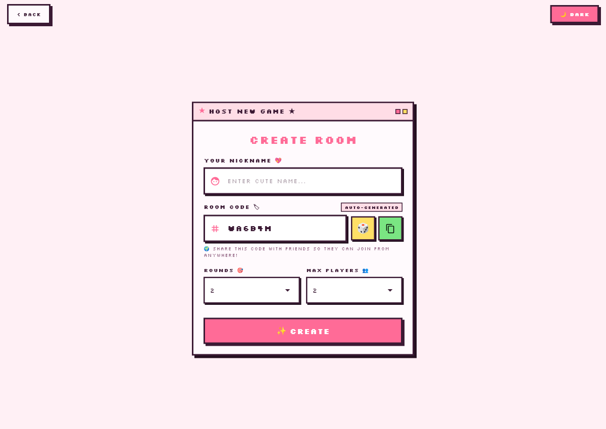
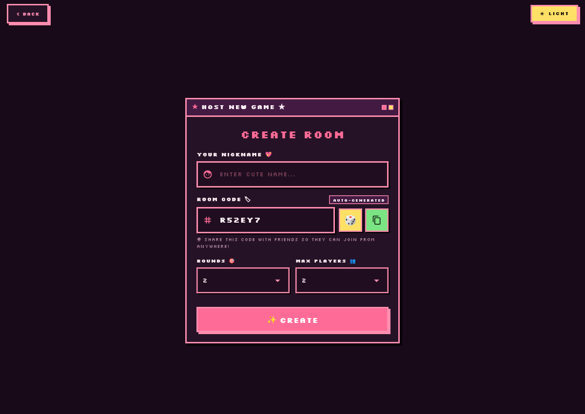
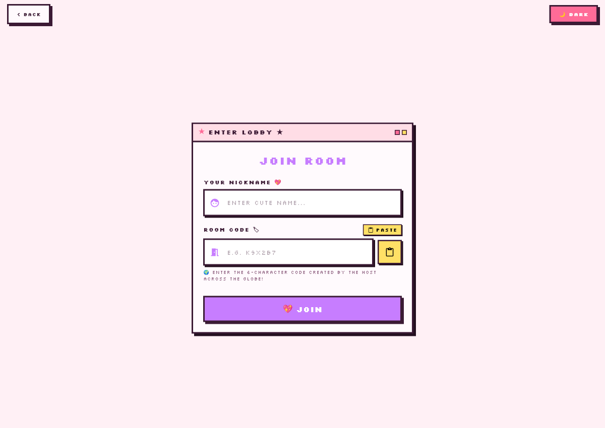
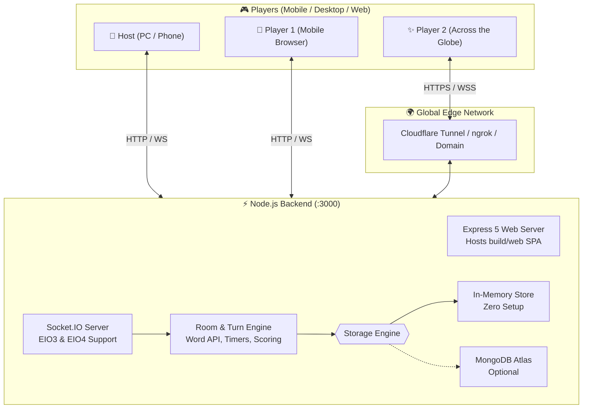

# 🎀 Skribbl.io — Cute Pink Pixel Art Edition 🎨💖

<div align="center">


**A real-time multiplayer drawing and guessing game built with Flutter and Node.js, styled in an adorable retro Japanese kawaii pixel-art theme.**

[Features](#-key-features) • [Quick Start](#-quick-start) • [Global Multiplayer](#-playing-across-the-globe) • [Architecture](#-architecture) • [Theme Guide](#-cute-pixel-art-theme)

</div>

---

## 🌸 Overview

**Skribbl.io Pixel Edition** reimagines the classic online multiplayer party game with a charming retro pixel-art aesthetic.

One player draws a secret word on an interactive canvas while the other players try to guess it in real time through live chat.

Whether you're playing together on the same Wi-Fi network or across different continents, friends can join instantly using simple **6-character alphanumeric room codes** or **one-click invite links**.

---

## ✨ Key Features

* **💖 Cute Pink Pixel Art Aesthetic**

  * Custom retro UI
  * Google Fonts: `Silkscreen` and `VT323`
  * 3D beveled button offsets
  * Chunky pixel borders
  * Tamagotchi-inspired lounge graphics

* **🌙 Reactive Dark & Light Mode**

  * **Strawberry Milk** light mode
  * **Cyberpunk Midnight Plum** dark mode
  * Instant theme switching across game screens
  * Game state remains intact while switching themes

* **🏷️ Auto-Generated Room Codes**

  * Clean 6-character alphanumeric codes
  * Example: `K9X2B7`, `7P4M8K`
  * 🎲 Re-roll button for generating new codes
  * 📋 One-tap copy support

* **🌍 Global Multiplayer**

  * Play across different Wi-Fi networks
  * Supports 4G/5G mobile connections
  * One-click invite links
  * Automatic room-code detection from URLs
  * Compatible with Cloudflare Tunnel, ngrok, and cloud deployments

* **🖌️ Real-Time Drawing Canvas**

  * Real-time drawing synchronization using WebSockets
  * Pixel-inspired color palette
  * Custom color picker
  * Adjustable stroke width
  * Clear-canvas functionality

* **💬 Live Chat & Scoring**

  * Real-time guessing chat
  * Automatic secret-word detection
  * Speed-based bonus scoring
  * Word-length hints such as `_ _ _ _ _`
  * Live scoreboard
  * Final winner leaderboard

* **⚡ Zero-Config Backend**

  * In-memory room storage works out of the box
  * No database required for local gameplay
  * Optional MongoDB Atlas support
  * Automatically uses MongoDB when `MONGODB_URI` is provided

* **📱 Built-in Flutter Web Hosting**

  * Node.js Express server can serve the compiled Flutter Web application
  * Players can open the game directly from mobile browsers
  * No APK installation required for web gameplay

---

## 📸 Screenshots & UI Showcase

### 🎀 Logo


### 🏠 Home Screen

|                                                             🎀 Logo                                                             |                                       🍓 Light Mode                                      |                                      🌙 Dark Mode                                      |
| :-----------------------------------------------------------------------------------------------------------------------------: | :--------------------------------------------------------------------------------------: | :------------------------------------------------------------------------------------: |
|  |  |  |

### 🎮 Room Creation & Joining

|                                   🎲 Create Room — Light                                  |                                     🌙 Create Room — Dark                                     |                                  🏷️ Join Room                                  |
| :---------------------------------------------------------------------------------------: | :-------------------------------------------------------------------------------------------: | :-----------------------------------------------------------------------------: |
|  |  |  |

---

## 🎨 Cute Pixel Art Theme

| Mode              | Background                | Windows / Cards       | Borders & Shadows             | Primary Accents              |
| :---------------- | :------------------------ | :-------------------- | :---------------------------- | :--------------------------- |
| **🍓 Light Mode** | Strawberry Milk `#FFF0F5` | Clean Cream `#FFFFFF` | Dark Chocolate Plum `#3B1A34` | Vibrant Berry Pink `#FF6B97` |
| **🌙 Dark Mode**  | Midnight Plum `#180A18`   | Cyber Slate `#261226` | Glowing Neon Berry `#FF8DAF`  | Neon Yellow & Lilac          |

---

## 🏗️ Architecture



---

# 🚀 Quick Start

## 📋 Prerequisites

Make sure you have the following installed:

* [Flutter SDK](https://docs.flutter.dev/get-started/install) `3.0.0+`
* [Node.js](https://nodejs.org/) `16.0.0+`
* Git

---

## 1️⃣ Clone the Repository

```bash
git clone https://github.com/IshaNayal/Skribbl.io.git
cd Skribbl.io
```

---

## 2️⃣ Set Up the Backend

Navigate to the server directory:

```bash
cd server
```

Install the backend dependencies:

```bash
npm install
```

Start the server:

```bash
node index.js
```

The server will start on port `3000`.

You should see output similar to:

```text
Serving Flutter Web app from: .../build/web
MONGODB_URI is not set; running with in-memory room store.
Server started and running on port 3000
```

### 🍃 Optional MongoDB Setup

MongoDB is **not required** for local gameplay.

If you want persistent database storage, create:

```text
server/.env
```

and add:

```env
MONGODB_URI=your_mongodb_connection_string
```

Then restart the backend server.

---

## 3️⃣ Run the Flutter App

Open a **new terminal** at the project root:

```bash
flutter pub get
```

### 🌐 Run on Chrome

```bash
flutter run -d chrome
```

### 🪟 Run on Windows

```bash
flutter run -d windows
```

### 📱 Run on Android

Connect an Android device or start an emulator, then:

```bash
flutter run -d android
```

---

# 🌍 Playing Across the Globe

You can host a game and invite friends from different Wi-Fi networks, mobile data connections, or countries without configuring traditional port forwarding.

## ☁️ Option A — Cloudflare Tunnel

Cloudflare Tunnel is the recommended option for quick testing.

With your Node.js server running on port `3000`, open another terminal and run:

```bash
npx cloudflared tunnel --url http://localhost:3000
```

Cloudflare will generate a public HTTPS URL similar to:

```text
https://random-subdomain.trycloudflare.com
```

### 🎮 How to Play

1. Open the generated URL in your browser.
2. Click **Create Room**.
3. Create your game room.
4. Click **Share Link** in the waiting lobby.
5. Send the generated invite link to your friends.
6. Friends open the link from anywhere in the world.
7. The room code is automatically detected and pre-filled.
8. Players join the room and start playing.

---

## 🔗 Option B — ngrok

If you prefer ngrok:

```bash
ngrok http 3000
```

Use the generated public URL to invite players.

---

# 📂 Project Structure

```text
Skribbl_io/
│
├── lib/
│   ├── config.dart
│   │   └── Dynamic server URL resolution & invite link generator
│   │
│   ├── create_room_screen.dart
│   │   └── Host room setup with auto-generated room codes
│   │
│   ├── final_leaderboard.dart
│   │   └── Retro podium and winner display
│   │
│   ├── home_screen.dart
│   │   └── Tamagotchi Lounge menu & room actions
│   │
│   ├── join_room_screen.dart
│   │   └── Join lobby with clipboard paste support
│   │
│   ├── main.dart
│   │   └── App entry point
│   │
│   ├── models/
│   │   ├── my_custom_painter.dart
│   │   │   └── Canvas painter for smooth touch lines
│   │   │
│   │   └── touch_points.dart
│   │       └── Touch coordinate & stroke data model
│   │
│   ├── paint_screen.dart
│   │   └── Main game screen
│   │
│   ├── sidebar/
│   │   └── player_scoreboard__drawer.dart
│   │       └── In-game live scoreboard drawer
│   │
│   ├── theme/
│   │   └── pixel_theme.dart
│   │       └── Pixel palette, themes & fonts
│   │
│   ├── utils/
│   │   └── room_code_generator.dart
│   │       └── Room code generation & URL parsing
│   │
│   ├── waiting_lobby_screen.dart
│   │   └── Roster lobby with copy code & invite link
│   │
│   └── widgets/
│       ├── custom_text_field.dart
│       │   └── Retro-themed pixel input field
│       │
│       └── pixel_widgets.dart
│           └── PixelButton, PixelWindow, PixelBadge,
│               PixelThemeToggle
│
├── server/
│   ├── api/
│   │   └── getWord.js
│   │       └── Random secret word generator
│   │
│   ├── models/
│   │   ├── Player.js
│   │   │   └── Player schema
│   │   │
│   │   └── Room.js
│   │       └── Mongoose Room schema
│   │
│   ├── index.js
│   │   └── Express + Socket.IO + Room Store
│   │
│   └── package.json
│
├── test/
│   ├── room_code_generator_test.dart
│   │   └── Room code & URL parsing tests
│   │
│   └── widget_test.dart
│       └── Room flow & UI widget tests
│
└── LICENSE
```

---

# 🧪 Testing

Run Flutter's static analyzer:

```bash
flutter analyze
```

Run the complete unit and widget test suite:

```bash
flutter test -j 1
```

---

# 🤝 Contributing

Contributions, issues, and feature requests are welcome!

### 1. Fork the Project

Create your own fork of the repository.

### 2. Create a Feature Branch

```bash
git checkout -b feature/CuteFeature
```

### 3. Commit Your Changes

```bash
git add .
git commit -m "Add some CuteFeature"
```

### 4. Push the Branch

```bash
git push origin feature/CuteFeature
```

### 5. Open a Pull Request

Open a Pull Request on GitHub describing your changes.

---

# 📄 License

Distributed under the **MIT License**.

See the [`LICENSE`](LICENSE) file for more information.

---

<div align="center">

### 🎀 Crafted with 💖 and 🍓 pixels by Isha Nayal

**Draw • Guess • Laugh • Repeat 🎨✨**

</div>

